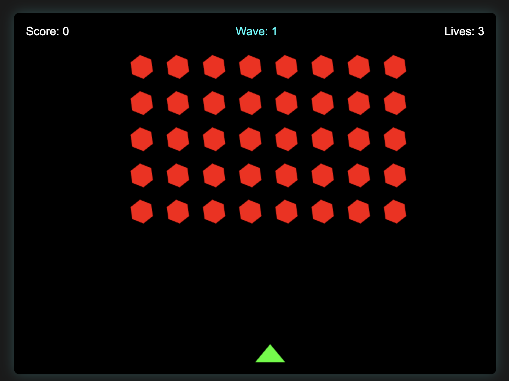

# Modern Space Invaders

A modern take on the classic Space Invaders arcade game, built with pure HTML5, CSS3, and JavaScript. Features a clean, minimalist design with dynamic enemy shapes and mobile support.

## Features

- 🎮 Responsive design - plays well on both desktop and mobile devices
- 🎯 Touch controls for mobile devices
- 🚀 Smooth animations and modern visual effects
- 🔄 Progressive difficulty with waves
- ⭐ Dynamic enemy shapes that change each wave:
  - Hexagons
  - Triangles
  - Squares
  - Circles
  - Stars
- 🌟 Rotating enemies with increasing rotation speed
- 📱 No dependencies - pure vanilla JavaScript

## How to Play

### Desktop Controls
- Use `←` and `→` arrow keys to move
- Press `Spacebar` to shoot
- Try to destroy all enemies before they reach your ship

### Mobile Controls
- Touch and drag anywhere on screen to move
- Touching the screen automatically fires
- Move and shoot simultaneously with a single touch

## Getting Started

1. Clone the repository: 